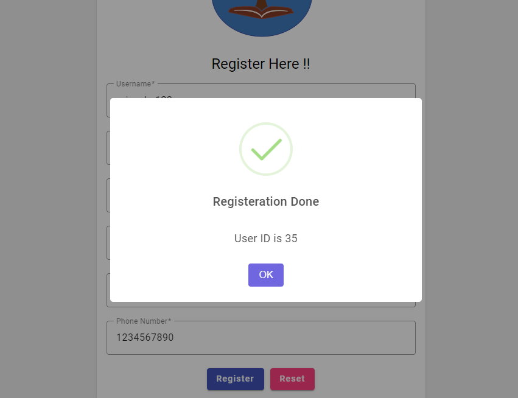

# educatree__mocktest_portal

<h4>Introduction</h4>
- Built a webapp which gives a platform to both teachers as well as students to enhance their productivity. Using this
app teachers can design their mock tests and all the students can access the tests by their student id. It has all the
required functionalities of a mock test portal along with two different UI (Admin and Normal).
- Currently working on this project, not deployed yet.

<h4>Progress report till now.</h4>
- We have implemented all the modern form validations while registeration and login of the user
- Server designing for login and registeration done.
- This server throws all the exceptions perfectly.
- After a successful login it redirects th e admin to admin dashboard , and normal user to normal dashboard.
- We have used JWT(Java Web Tokens) authentication logic for login.

# Technologies Involved

- Frontend: `Angular Js`, `Angular Material`, `Sweetalert`
- Backend: `Spring Boot`, `Hibernate Sequence`
- Security: `Spring Security`

# Preview

 

  
   
    
     
      

# Description
- Above are UI snaps of Home,Login and Registeration pages.
- After a successful login , sweetalert gives ID of the user.

# Credits
- <a href="https://github.com/rahul87911">Rahul Mishra</a>
- Thanks for visiting here.
